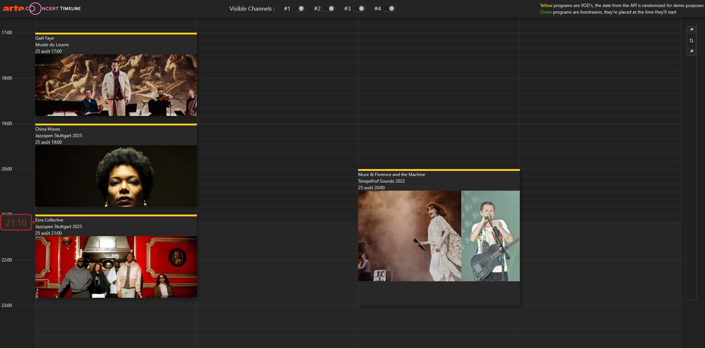

# Arte Concert Timeline

> Originally started as an internal prototype at Arte to centralize **data-driven visualization** of concerts.

So it's a re-implementation of an old project, now built with **Vite + React + TypeScript**.  
It scrapes the [arte.tv](https://www.arte.tv) website to retrieve the list of upcoming livestreams, and lays them out on an interactive **timeline view**.

## Features

- Clearly shows upcoming events and how they overlap.
- Complete streams metadata are present.  
  (The earlier version also launched the Arte video player when a stream started.  
  This was intentionally removed here, since the player is proprietary and would require constant reverse-engineering to keep in sync.)
- Automatic scraping of livestreams (cached hourly, frequency configurable via config file).
- Live updating of the current time marker.
- Zoom & navigation tool inspired by video editing software.
- UI focused on content rather than interface chrome.

## Screenshots

## Try it out

Visit the [production site](http://arteconcerttimeline.kinegraphx.com) and explore what’s streaming next on Arte Concert.
